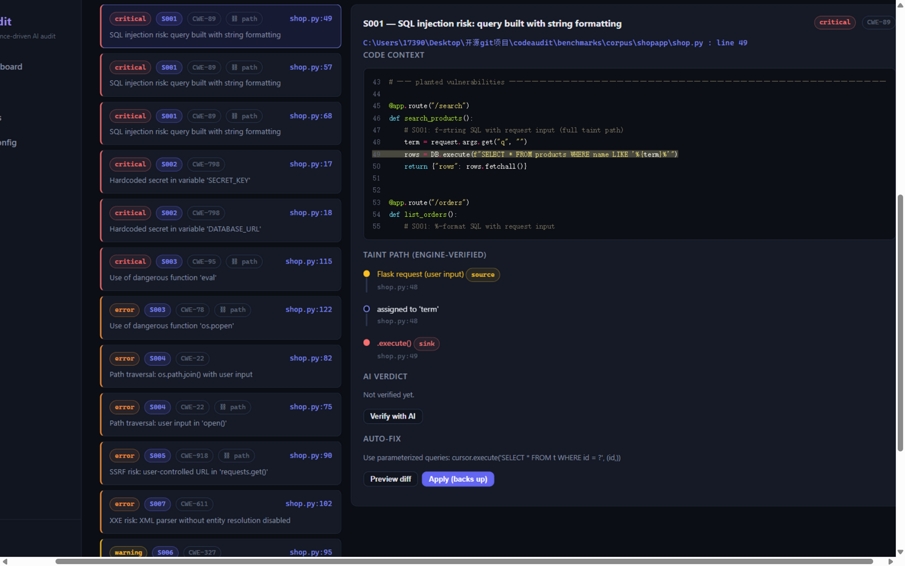
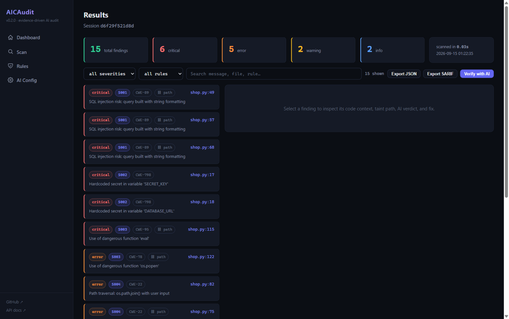

# aicaudit

> Static analysis that shows its work, plus AI that doesn't make things up.
>
> 闭嘴给证据的 Python 代码审计：静态引擎先把污点路径走通，AI 只负责拿着证据下结论。

<p align="center">
  <a href="https://pypi.org/project/aicaudit/"></a>
  <a href="https://github.com/IhateStomachProblems/aicaudit/actions/workflows/ci.yml"></a>
  
  
  
  
  
</p>

---

## Why I built this

I like what Bandit tries to do, and I like what LLMs can do for code review. I got tired of what both do wrong.

Bandit will flag `eval("1+1")` — a string literal — as a critical injection risk. It will tell you `os.path.join(BASE_DIR, "config.json")` is a path traversal because `BASE_DIR` is a variable, even when it's built from `__file__` three lines up. So you either drown in noise or start ignoring the tool.

The new wave of AI review tools has the opposite problem: confident verdicts with nothing behind them. Ask an LLM "is this SQL injection?" and it'll happily guess from a one-line snippet.

aicaudit is my attempt at the missing middle ground. A taint engine does the boring, verifiable work first — it traces user input from `request.args`, `input()`, `os.environ` through your assignments, f-strings and function calls, right up to the dangerous sink. Constants get *proven* safe and stay quiet. If a path from user input to the sink actually exists, you get the whole thing spelled out, hop by hop. Only then does an LLM get involved, and it doesn't get to guess: it sees the full function and the traced path, and its answer lands in one of three buckets — confirmed, false positive, or "not sure". The last one is a real answer here, not a failure.

```text
S001  shop.py:49  SQL injection risk
  taint path: shop.py:48 request.args (Flask user input)
           -> shop.py:48 assigned to 'term'
           -> shop.py:49 .execute()
```

That's a real output, from the screenshot below, from a real scan.

<p align="center">
  <a href=".github/assets/web-taint-path.png"></a>
  <br><sub>Actual UI, actual scan of a deliberately vulnerable Flask app. Zero retouching.</sub>
</p>

---

## Quick start

```bash
pip install aicaudit
aicaudit scan ./src
```

That's the whole onboarding. No config file required, no tree-sitter compilation step, no account.

Other things you'll probably want:

```bash
aicaudit scan ./src --output json      # for scripts and CI
aicaudit scan ./src --output sarif     # GitHub Code Scanning eats this directly
aicaudit scan ./src --lang zh          # 中文输出
aicaudit scan ./src --ai               # attach AI verdicts (marks, never hides)
aicaudit scan ./src --fail-on error    # CI gate: exit 1 if anything error+
aicaudit web                           # local web UI at 127.0.0.1:8080
```

---

## What it checks

15 rules at the moment — 8 security, 5 quality, 2 performance. The security ones are where the taint engine earns its keep.

| ID | Rule | Severity | Taint-aware |
|----|------|----------|-------------|
| S001 | SQL injection | critical | yes |
| S002 | Hardcoded secrets | critical | — |
| S003 | Dangerous functions (eval, exec, pickle, os.system…) | error | yes |
| S004 | Path traversal | error | yes |
| S005 | SSRF | error | yes |
| S006 | Weak crypto (MD5/SHA1/DES/ECB) | warning | — |
| S007 | XXE | error | yes |
| S008 | Insecure random | warning | — |
| Q001–Q005 | bare except, magic numbers, undefined names, TODOs, unused vars | info–error | — |
| P001–P002 | cyclomatic complexity, nesting depth | warning | — |

"Taint-aware" means the rule asks the engine whether user input actually reaches the sink. Provably constant arguments don't fire — which is why aicaudit doesn't flag `open(config_path)` when `config_path` was literally defined three lines up, and doesn't flag `eval("1+1")` at all.

Every security finding carries a **CWE** and, when a path was traced, the full **source → hops → sink** chain — in the terminal output, in JSON/Markdown, and as native SARIF `codeFlows` that render in the GitHub Security tab.

Inline suppression works the way you'd expect:

```python
query = f"SELECT * FROM users WHERE id={user_id}"  # aicaudit: ignore S001
```

---

## The AI part (optional, honest by construction)

`--ai` sends each finding to an LLM — but not as a bare snippet. It gets the enclosing function, the file's imports, and the traced taint path, plus instructions tuned to the finding type (injection findings get "check the sanitizer on this path"; policy findings like weak hashes get "judge the usage context"). Then the verdict is one of exactly three things:

- **confirmed** — AI agrees it's real, with a confidence score
- **false_positive** — AI explains which sanitizer or fact kills it
- **unverified** — the AI was missing, errored, timed out, or answered with low confidence

That third state is the point. An unparseable or lazy AI answer never becomes a silent pass. If you want aggressive filtering anyway, `--ai-strict` keeps only confirmed findings — but the research I based this on ([arXiv 2601.22952](https://arxiv.org/abs/2601.22952)) found the best LLM verifiers still wrongly suppress ~22% of true vulnerabilities, so the default is: mark everything, hide nothing.

Works with OpenAI-compatible relays (中转), OpenAI, Claude, OpenRouter, or a local ollama. No API key? Everything above still works — you just don't get AI verdicts.

---

## The web UI

```bash
aicaudit web    # http://127.0.0.1:8080
```

No CDN, no npm, no build step — the CSS and JS are vendored, so it works on an air-gapped machine. What you get:

- code context around each finding with server-side syntax highlighting
- the taint path drawn as a **stepper**: source in yellow, sink in red, hops in between
- AI verdict cards with confidence, and a diff-preview → apply → rollback loop for fixes (with `.bak` backups)
- live per-file scan progress (SSE — not a fake progress bar), and scan history that survives restarts

<p align="center">
  <a href=".github/assets/web-results.png"></a>
</p>

---

## Benchmarks — with the receipts

There's a labeled corpus in `benchmarks/` (104 cases: function-level samples plus a small Flask app with planted bugs) and a runner that scores aicaudit **and Bandit** on it:

```bash
python benchmarks/run.py
```

Current result: 100% precision and recall on all 8 security rules, with 4 of them carrying full taint paths. Bandit, on the comparable buckets, lands between 67% and 100% F1 and doesn't cover path traversal, SSRF, or insecure random at all.

Now the honest part: it's *my* corpus. I labeled it, so my tool scoring 100% on it deserves your skepticism — that's exactly why the runner, the ground truth, and the corpus are all in the repo. Run it, extend it, break it. The report also documents where aicaudit is deliberately conservative and where it's deliberately silent (constant arguments to dangerous functions are a code smell, not an injection — Bandit flags those; aicaudit doesn't, on purpose, and says so in the results file).

---

## CI, hooks, custom rules

One-line GitHub Action (the composite action lives in this repo):

```yaml
- uses: IhateStomachProblems/aicaudit@main
  with:
    fail-on: error
    sarif: "true"
```

pre-commit hook definition is in [.pre-commit-hooks.yaml](.pre-commit-hooks.yaml). Project config is one command away (`aicaudit init` writes `[tool.aicaudit]` into your pyproject.toml).

Custom rules are plain Python files dropped into `.aicaudit/rules/` — no DSL, no core changes:

```python
import ast
from aicaudit.rules.base import Finding, Rule, Severity, register

@register
class NoPrint(Rule):
    id = "Q100"
    name = "no-print"
    severity = Severity.INFO
    description = "Detect print() calls"

    def check(self, tree, context):
        return [Finding(rule_id=self.id, message="print() — prefer logging",
                        message_zh="print()——建议改用 logging",
                        file=str(context.file_path), line=n.lineno,
                        severity=self.severity)
                for n in ast.walk(tree)
                if isinstance(n, ast.Call) and isinstance(n.func, ast.Name)
                and n.func.id == "print"]
```

A full working example is in [examples/custom_rule_example.py](examples/custom_rule_example.py). (A YAML rule format is planned for v0.3 — issue [#2](https://github.com/IhateStomachProblems/aicaudit/issues/2).)

---

## What it won't do

- It's **Python only** for now. JS/TS and Go are on the roadmap ([#3](https://github.com/IhateStomachProblems/aicaudit/issues/3), [#4](https://github.com/IhateStomachProblems/aicaudit/issues/4)).
- The taint engine is intra- and inter-procedural within what AST analysis can see. Dataflow through closures, metaprogramming, or C extensions will be missed. That's a fundamental limit of this approach, not a bug I haven't fixed.
- AI verdicts need an API key (or a local model). Without one you still get everything static.
- It's a young project. It will miss things and it will occasionally annoy you — tell me about both.

Performance, for the curious (including interpreter startup, worst of 3 runs, Python 3.13): single file ~0.17s, this repo's own 44-file codebase ~0.70s.

---

## The numbers behind the badges

305 tests, 92% coverage, ruff and mypy clean, CI on Python 3.10–3.13. All of it runs in [Actions](https://github.com/IhateStomachProblems/aicaudit/actions) on every push, and the self-scan step audits aicaudit with aicaudit.

If you want to contribute: [CONTRIBUTING.md](CONTRIBUTING.md) has the setup, the gates, and a note on why fixtures full of fake vulnerabilities live in `tests/` and `benchmarks/`.

## License

MIT. See [LICENSE](LICENSE).

---
---

<div align="center">

# AICAudit 中文版

</div>

## 我为什么写这个

Bandit 的思路我认可，LLM 做代码审查的潜力我也认可，但两家的毛病我都忍不了。

Bandit 会把 `eval("1+1")` 这种字符串字面量报成严重注入风险，会把 `os.path.join(BASE_DIR, "config.json")` 报成路径穿越——就因为 `BASE_DIR` 是个变量，哪怕它三行前刚从 `__file__` 算出来。结果就是要么被噪音淹没，要么把工具关掉。

新一代 AI 审查工具正好反过来：结论给得斩钉截铁，依据一个字没有。丢一行代码问 LLM"这是不是 SQL 注入"，它真敢直接答。

aicaudit 是我补中间地带的尝试。污点引擎先干枯燥但可验证的活：把用户输入从 `request.args`、`input()`、`os.environ` 一路追过赋值、f-string、函数调用，直到危险的 sink。常量会被**证明**安全，然后闭嘴。只有当真有一条从用户输入到 sink 的路时才报警，而且整条路一步一步给你列出来。LLM 是最后才上场的，它不许猜——它拿到的是完整函数体加这条路径，结论只有三种：confirmed（真问题）、false_positive（误报，并说明是哪个净化器挡住了）、unverified（没把握）。

第三种才是这个工具的态度。AI 没答上来、答烂了、置信度低，都老老实实标"未验证"，绝不偷偷放行。想激进过滤也行，`--ai-strict` 显式开启——但我参考的研究（[arXiv 2601.22952](https://arxiv.org/abs/2601.22952)）实测过，最好的 LLM 验证器也会错杀约 22% 的真漏洞，所以默认是：全标出来，一个不藏。

## 上手

```bash
pip install aicaudit
aicaudit scan ./src              # 扫描
aicaudit scan ./src --lang zh    # 中文输出
aicaudit scan ./src --ai         # 附带 AI 判定
aicaudit scan ./src --fail-on error   # CI 门禁：有 error 及以上就退出码 1
aicaudit web                     # 本地 Web 界面（127.0.0.1:8080）
```

不需要配置文件，不需要编译 tree-sitter，不需要注册任何账号。

## 它能查什么

15 条规则：8 条安全（SQL 注入、硬编码密钥、危险函数、路径穿越、SSRF、弱加密、XXE、不安全随机数）、5 条质量、2 条性能。安全规则全部带 **CWE 编号**，能追到污点路径的会把 **source → 传播 → sink** 整条链给你——终端、JSON/Markdown、GitHub Security Tab（SARIF codeFlows 原生渲染）里都能看。

误报这事是认真处理过的：常量参数不触发（引擎会证明它安全）、净化器会掐断路径（`os.path.basename`、`int()`、参数化查询这些都认）、行内 `# aicaudit: ignore S001` 想压就压。

## 基准，带收据

`benchmarks/` 里有 104 个标注用例（函数级样例加一个故意埋洞的 Flask 小应用）和一个评分脚本，aicaudit 和 Bandit 同台跑：

```bash
python benchmarks/run.py
```

当前成绩：8 条安全规则全部 **100% 精确率 / 100% 召回率**，其中 4 条带完整污点路径。Bandit 在可比项目上 F1 介于 67%–92%，路径穿越、SSRF、不安全随机数三个类目它根本不覆盖。

老实说：语料是我标的，我的工具在我自己的语料上拿满分，你完全有理由怀疑——所以标注、跑分脚本、语料全在仓库里，欢迎跑一遍、加用例、来打脸。报告里也写明了哪些场景工具是故意保守、哪些是故意沉默的（比如常量参数的危险函数调用是坏味道不是注入，Bandit 报，aicaudit 故意不报，结果文件里写得明明白白）。

## Web 界面

```bash
aicaudit web    # http://127.0.0.1:8080
```

零依赖、离线可用（CSS/JS 全部内置，不连任何 CDN）。每个 finding 点开是三段式：高亮代码上下文、**污点路径步进图**（黄点源头、红点汇聚）、AI 判定卡（带置信度）。修复支持 diff 预览 → 应用（自动 .bak 备份）→ 一键回滚。扫描进度是逐文件实时推送，历史记录重启不丢。

## CI 和自定义规则

GitHub Actions 一行接入：

```yaml
- uses: IhateStomachProblems/aicaudit@main
  with:
    fail-on: error
    sarif: "true"
```

自定义规则就是普通 Python 文件，丢进 `.aicaudit/rules/` 就生效，不用改核心代码，完整示例在 [examples/custom_rule_example.py](examples/custom_rule_example.py)。AI 接口支持 OpenAI 兼容中转、OpenAI、Claude、OpenRouter、本地 ollama，在 Web 界面的 AI Config 页点点就能配。

## 它做不到的

- 目前**只支持 Python**。JS/TS 和 Go 在路线图里（[#3](https://github.com/IhateStomachProblems/aicaudit/issues/3)、[#4](https://github.com/IhateStomachProblems/aicaudit/issues/4)）。
- 污点引擎基于 AST，闭包、元编程、C 扩展里的数据流追不到——这是这条技术路线的天然边界，不是没修的 bug。
- AI 判定需要 API key 或本地模型，没有也行，静态部分全都能用。
- 项目还年轻，会有漏报，也会偶尔烦你。两种情况都欢迎开 issue 骂我。

徽章背后的数字：305 个测试、92% 覆盖率、ruff/mypy 零告警、Python 3.10–3.13 全线 CI，每次 push 都会在 Actions 里用 aicaudit 扫 aicaudit 自己。

## License

MIT · [LICENSE](LICENSE)
